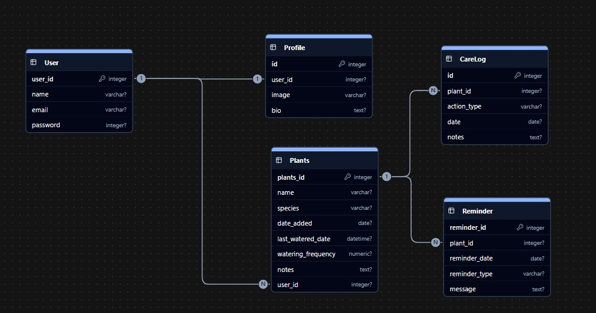

# planet_keeper
## 🌿 Plant Keeper – Project README

### 📘 Project Overview

The Plant Keeper project is a practical Django web application designed to help users take better care of their plants.
It enables users to record important details such as plant name, species, and watering frequency, and provides reminders when it’s time to water them.

The main goal of this project is to make plant maintenance easy and consistent by offering an intuitive system that tracks watering schedules and plant health over time.

### 🧠 Objectives

-Help users manage their plants efficiently.

-Remind users when a plant needs watering.

-Store and track information such as plant name, type, and watering schedule.

-Demonstrate Python fundamentals including loops, conditionals, file handling, and date operations.

-Provide a base that can be expanded into advanced applications (with GUI or notifications)

### ⚙️ Tech Stack

| Category            | Tools & Technologies        |
| ------------------- | --------------------------- |
| **Frontend**        | HTML, CSS, Django Templates |
| **Backend**         | Django (Python Framework)   |
| **Database**        | SQLite                      |
| **Version Control** | Git & GitHub                |
| **IDE / Tools**     | Visual Studio Code          |

### 🗃️ Database Design (ERD Overview)

The project includes the following models:

## User (Django default model)
| Field    | Type                 | Description          |
| -------- | -------------------- | -------------------- |
| user_id  | Serial (Primary Key) | Unique user ID       |
| name     | CharField            | Name of the user     |
| email    | CharField            | Email of the user    |
| password | CharField            | Password of the user |

## Profile
| Field   | Type                 | Description                |
| ------- | -------------------- | -------------------------- |
| id      | Serial (Primary Key) | Unique profile ID          |
| user_id | ForeignKey(User)     | Related user               |
| image   | ImageField           | Profile picture of user    |
| bio     | TextField            | Short biography or details |

## Plants
| Field              | Type                 | Description                     |
| ------------------ | -------------------- | ------------------------------- |
| plant_id           | Serial (Primary Key) | Unique plant ID                 |
| name               | CharField            | Name of the plant               |
| species            | CharField            | Type or species of the plant    |
| date_added         | Date                 | Date plant was added            |
| last_watered_date  | DateTime             | Last date the plant was watered |
| watering_frequency | Integer              | Watering times per week         |
| notes              | TextField            | Additional notes                |
| user_id            | ForeignKey(User)     | The owner of the plant          |

## CareLog
| Field       | Type                 | Description                      |
| ----------- | -------------------- | -------------------------------- |
| id          | Serial (Primary Key) | Unique care log ID               |
| plant_id    | ForeignKey(Plant)    | Plant being cared for            |
| action_type | CharField            | Action performed (e.g., Watered) |
| date        | Date                 | Date of the action               |
| notes       | TextField            | Additional notes                 |

## Reminder
| Field         | Type                 | Description                           |
| ------------- | -------------------- | ------------------------------------- |
| reminder_id   | Serial (Primary Key) | Unique reminder ID                    |
| plant_id      | ForeignKey(Plant)    | Related plant                         |
| reminder_date | Date                 | Date for the reminder                 |
| reminder_type | CharField            | Type of reminder (e.g., Water, Prune) |
| message       | TextField            | Reminder message or details           |

    📊 An ERD diagram illustrating these relationships can be added here as an image:

### 💻 Installation Guide

Follow these steps to set up the project locally:

1.Clone the repository:

    git clone https://git.generalassemb.ly/leends/plant_keeper.git
    cd plant_keeper

2.Create a virtual environment:

    python -m venv venv
    source venv/Scripts/activate   # for Windows
    # or
    source venv/bin/activate       # for macOS/Linux

3.Install dependencies:

    pip install -r requirements.txt

4.Apply migrations:

    python manage.py migrate

5.Run the development server:

    python manage.py runserver

6.Open the app:
    Go to http://localhost:8000   

### 🧪 Running Tests

To ensure the application works as expected, automated tests are provided for the models and views.

-Run all tests with:

    python manage.py test main_app

-You should see an output similar to:

    Found 14 test(s).
    Creating test database for alias 'default'...
    System check identified no issues (0 silenced).
    ..............
    Ran 14 tests in 29.509s

    OK
    Destroying test database for alias 'default'...

-These tests cover:

1.Plant model methods (needs_watering, next_watering_date)

2.Reminder model methods (is_due, mark_completed)

3.CRUD views for Plants (list, detail, create, update, delete)

4.CRUD views for Reminders (list, create)

5.Authentication-required access for protected views 

### 👥 User Stories

| # | User Type   | User Story                                                                          | Acceptance Criteria                                 |
| - | ----------- | ----------------------------------------------------------------------------------- | --------------------------------------------------- |
| 1 | Plant Owner | As a user, I want to create an account so that I can register my plants.            | User can sign up and log in successfully.           |
| 2 | Plant Owner | As a user, I want to register plants with details so that I can track their growth. | User can add a new plant with all required details. |
| 3 | Plant Owner | As a user, I want to update plant information so that I can keep accurate records.  | User can edit plant details.                        |
| 4 | Plant Owner | As a user, I want to delete a plant if I no longer own it.                          | User can delete any plant they own.                 |
| 5 | Plant Owner | As a user, I want to view all my plants in one place.                               | Dashboard shows all user plants.                    |

### 🚀 Future Enhancements

    1.Smart watering notifications (via email or SMS)
    2.Image upload for each plant
    3.Recommendation system with care tips
    4.Dark mode support
    5.Community sharing page

### 🧩 Challenges & Solutions

### 📝 Summary

    Plant Keeper simplifies plant care by organizing plant data, tracking watering schedules, and providing reminders — turning daily plant care into a smooth and enjoyable experience.
    It also serves as a great project for learning Django, database modeling, and full-stack web development fundamentals.

### 🧑‍💻 Team Members

    Leen EmadAddin AbdelHalim
    Lana Omar Khamis
    Lujain Alhaddad